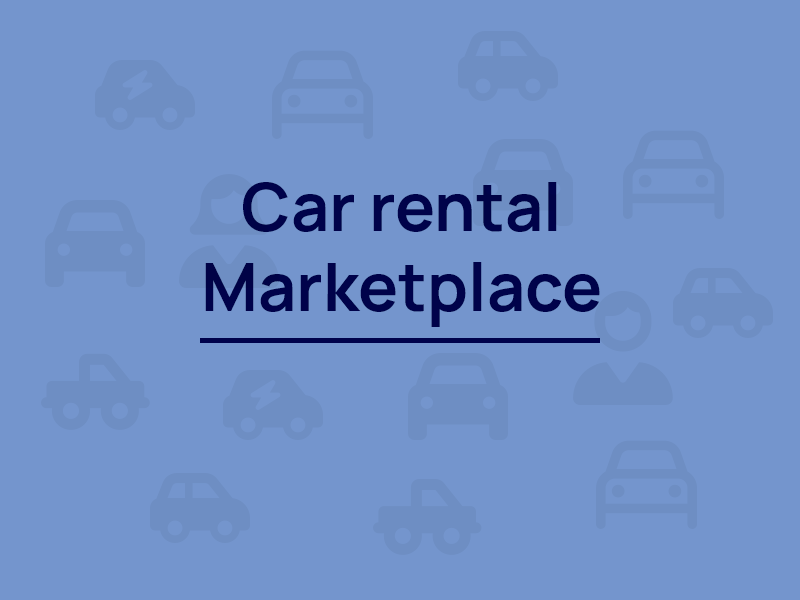
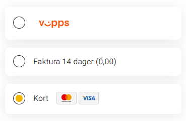
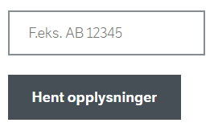
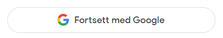

# Documentation for car rental marketplace <!-- omit in toc -->

**Authors:** _Marius Christian Aastebøl, Marius Begby, Dag Kristian Lode Gjerberg, Daniel Nilsen Johansen, Bharati Mainali_

# Table of contents <!-- omit in toc -->

- [1. Project outline](#1-project-outline)
  - [1.1. Overview](#11-overview)
  - [1.2. Project justification](#12-project-justification)
  - [1.3. Approach](#13-approach)
- [2. Product scope and core functionality](#2-product-scope-and-core-functionality)
  - [2.1. Value proposition](#21-value-proposition)
  - [2.2. Core features](#22-core-features)
  - [2.3. Minimum viable product (MVP)](#23-minimum-viable-product-mvp)
- [3. Use cases, personas and scenarios](#3-use-cases-personas-and-scenarios)
  - [3.1. General user actions](#31-general-user-actions)
  - [3.2. Personas](#32-personas)
  - [3.3. Scenarios](#33-scenarios)
- [4. Extended system description](#4-extended-system-description)
  - [4.1. Accessing the platform](#41-accessing-the-platform)
  - [4.2. Users and registration on the platform](#42-users-and-registration-on-the-platform)
  - [4.3. Managing rental adverts](#43-managing-rental-adverts)
  - [4.4. History of previous rentals](#44-history-of-previous-rentals)
  - [4.5. Communication and interacting with other users](#45-communication-and-interacting-with-other-users)
  - [4.6. Notifications on the platform](#46-notifications-on-the-platform)
  - [4.7. Browsing and searching for rentals](#47-browsing-and-searching-for-rentals)
  - [4.8. Rental agreements between users](#48-rental-agreements-between-users)
  - [4.9. Picking an advert and placing a booking](#49-picking-an-advert-and-placing-a-booking)
  - [4.10. Administrative functionality](#410-administrative-functionality)
- [5. Dependencies and external services](#5-dependencies-and-external-services)
  - [5.1. Persistent storage and backup](#51-persistent-storage-and-backup)
  - [5.2. Location provider service](#52-location-provider-service)
  - [5.3. Payment solution](#53-payment-solution)
  - [5.4. Registration number lookup](#54-registration-number-lookup)
  - [5.5. Authentication provider](#55-authentication-provider)
  - [5.6. External communication provider](#56-external-communication-provider)
- [6. Requirements and priority estimation](#6-requirements-and-priority-estimation)
  - [6.1. Webapp](#61-webapp)
  - [6.2. UserProfile](#62-userprofile)
  - [6.3. RentalAdvertManagement](#63-rentaladvertmanagement)
  - [6.4. Review](#64-review)
  - [6.5. History](#65-history)
  - [6.6. Messaging](#66-messaging)
  - [6.7. Search](#67-search)
  - [6.8. SettingUpAgreements](#68-settingupagreements)
  - [6.9. Administrative](#69-administrative)
  - [6.10. System](#610-system)
  - [6.11. Requirements estimations](#611-requirements-estimations)
- [7. About the prototype](#7-about-the-prototype)
  - [7.1. Limitations](#71-limitations)
  - [7.2. Minimum viable product interpretation](#72-minimum-viable-product-interpretation)
  - [7.3. Our choices and prioritizations](#73-our-choices-and-prioritizations)
  - [7.4. Encountered problems](#74-encountered-problems)
  - [7.5. Setting up and running the prototype](#75-setting-up-and-running-the-prototype)
    - [7.5.1. Prerequisites](#751-prerequisites)
    - [7.5.2. To run the app](#752-to-run-the-app)
    - [7.5.3. Running tests](#753-running-tests)
    - [7.5.4. Resetting data](#754-resetting-data)
    - [7.5.5. Troubleshooting](#755-troubleshooting)

# 1. Project outline

## 1.1. Overview

The primary goal of the system is for individuals to be able to rent cars from other individuals, or to rent out their own cars when not in use. A registered user can both rent cars or rent out their own cars, just like an open marketplace.

The platform will provide an easy way for individuals to find and rent a car for cheap when in need, or to earn some extra money on the side by renting out their cars. The platform will have a focus on ease of use and provide tools to remove unnecessary difficulties, obstacles and ensuring safety for both sides.

## 1.2. Project justification

Individuals that do not own cars sometimes need a car, whether it be for driving to family members, picking up a big package at the store, a trip to the cabin or something else. Why won't these individuals rent a car at their local car rental? Well, it turns out that car rentals aren't as accessible, and they can also be quite costly.

The solution to the problem? It also happens to be that individuals that own cars don't need them all the time, and might have them parked for many days without use. This is an open opportunity for these individuals to make some extra money.

However, there is no platform for this kind of service, where individuals can both rent or rent out cars between each other, without any car rental as a "middleman". At least not one that is focused on ease of use and being user friendly. Being tasked with making a proposed solution for a startup, this project documentation describes how a platform that solves these issues could be created.

A platform with these goals will have many requirements, and we will be describing these in detail later in the documentation.

## 1.3. Approach

We believe that agile development should be core when creating an implementation of the described system. Agile development will encourage more innovative solutions along the way, with rapid feedback and adjustments when needed. We also believe the use of agile methodology will result in a more feature-rich product that can be delivered sooner to the market.

# 2. Product scope and core functionality

## 2.1. Value proposition

There will mainly be two types of individuals on the platform:

-   Individuals that are in need of a car for some period of time, and want to find affordable options without too much hassle.
-   Individuals that own cars but sporadically don't use them, both for shorter and longer periods of time.

Whether it be for driving to a family gathering, transporting a big package or go on holiday, the first group of individuals are in need of a car for transport. For obvious reasons, public transport or other ways of transport are not the best option. Driving a car is more flexible. It gets you where you want and when you want.

Car rentals can be quite expensive and might also be a hassle to find if you live in rural areas. The platform for the proposed solution to the issue will provide great value for this group of individuals. This allows them to access the service anywhere and makes it easier to find nearby available rentals.

For the second group of individuals there is no simple way for them to make money from their cars when they are not in use. The platform will be able to provide a way for them to earn some extra money instead of leaving their unused cars parked. Being able to quickly register a user and an advert gives great value to the user. This platform makes it easy to let other people use your car in exchange for some money.

## 2.2. Core features

In the context of the two main types of users on the platform, the core features will include:

-   Easy registration of new user accounts.
-   Finding available rentals by browsing the marketplace, with search and filtering options to find just what you are looking for.
-   Entering an agreement with another user for a rental through predefined terms, that can be altered by the user if desired.
-   Providing an interface to communicate with other users when wanting to rent a car or ask questions during the rental. This will include a live chat with extra functionality in addition to text messages.
-   Quick and simple registration of new rental adverts on the marketplace. It will also give the ability to enter a registration number and pull details from the national vehicle registry to fill in parts of the form. A rental advert should be able to include images and also specifications that later can be filtered through when searching.
-   Providing security for both parties of a rental. This means serving a secure way to handle the transaction, both in terms of money and other things that needs to be exchanged or be taken care of. This includes the economic transaction, exchanging car keys and problems that might arise such as "Who will be filling the tank?".

## 2.3. Minimum viable product (MVP)

The minimum viable product will be a cut-down version of the core features, that includes the most critical functionality. This includes:

-   Registration of new user accounts, with the required information.
-   Being able to register new rental adverts with information about the car and specifications including images.
-   The ability to delete or edit existing rental adverts.
-   Messaging other users through the rental adverts to plan and make deals for rentals.
-   Searching for and browsing available rentals by searching for keywords or filtering on specifications, such as price, seats or fuel type.

The MVP will not include extended functionality such as:

-   Profiles having additional information, such as profile images, status symbols (online, offline etc.).
-   External connected services such as APIs for retrieving car details based on registration number, or a location provider to show nearby rental adverts.
-   Having predefined and customizable rental agreements for ease of use when making a deal.
-   Customizable user settings and preferences.
-   Extensive validation on inputs to ensure users do not accidentally enter incorrect information.
-   A page for administrative purposes to easily manage the platform.
-   A system to rate other users after ending an agreed rental.
-   A flexible booking system that allows users to display planned available and booked timeslots.
-   Infrastructural and maintenance related functionality. For example logging of actions on the platform, automatic backup of data, etc.
-   Other "nice to have" features that are not strictly necessary or providing a great amount of value to the users of the platform or from a business perspective.

Administrative users are going to have all the capabilities of a normal user profile with added functionality. They should be able to create vehicle adverts, delete and edit the car adverts like a normal user. They should also have ability to change the vehicle adverts of other users. Administrative users should also be able to edit the other normal user profile information like e-mail, phone number, name and password. The admin must also be able to access an admin panel where they can edit all the content and user information. If an administrator is editing a user’s information the affected will be notified. Editing of vehicle adverts should be available on the car advert page and in the admin panel. The admin user is hardcoded and is not available for normal users to create. These accounts will be exclusive to the people that manage the platform.

# 3. Use cases, personas and scenarios

## 3.1. General user actions

All registered users on the platform can both rent or rent out cars, and are therefore both a renter and a rentee. Usually, a user will only be within one of the categories. This section shows some general actions you can perform as a rentee and a renter.

### 3.1.1. Rentee use case <!-- omit in toc -->

@startuml
title Use case: Rentee
left to right direction

'--------------Actors---------------
actor Rentee as r

'--------------Usecases---------------
Usecase cp as "Create profile"
Usecase cs as "Change settings and preferences"
Usecase si as "Create a support inquiry"
Usecase fv as "Browse rental adverts"
Usecase rv as "Book rentals"
Usecase cr as "Message rental car owner"
Usecase rf as "Submit rating and feedback of the renter"

'--------------Lines---------------
r --> cp
r --> cs
r --> si
r --> fv
r --> rv
r --> cr
r --> rf

'--------------Footer---------------
center footer ""
@enduml

_Use case diagram showing actions as rentee. Author: Everyone in the group._

### 3.1.2. Renter use case <!-- omit in toc -->

@startuml
title Use case: Renter
left to right direction

'--------------Actors---------------
actor Renter as r

'--------------Usecases---------------
Usecase cp as "Create profile"
Usecase cs as "Change settings and preferences"
Usecase si as "Create a support inquiry"
Usecase rv as "Register new rental adverts"
Usecase gn as "Receive booking inquires"
Usecase gh as "Setting up rental agreements/contracts"
Usecase gf as "Submit rating and feedback of the rentee"

'--------------Lines---------------
r --> cp
r --> cs
r --> si
r --> rv
r --> gn
r --> gh
r --> gf

'--------------Footer---------------
center footer ""
@enduml

_Use case diagram showing actions as renter. Author: Everyone in the group._

## 3.2. Personas

### 3.2.1. Bendik Moholt <!-- omit in toc -->

Gender: Male

Age: 82

Location: Suburban

Employment: Retired

Civil status: Widower

Needs and goals: Get more income by renting out one of the cars.

Frustrations: Struggle to learn new things. Prefers larger UI and easy to use apps.

Behaviors: Forgets things easily. Likes to walk instead of driving. Likes to talk with anyone.

License class: Class B and D (bus)

Owns car(s): Two cars, rarely use any.

### 3.2.2. Kenneth Larsen <!-- omit in toc -->

Gender: Male

Age: 22

Location: Urban

Employment: Student

Civil status: Unmarried

Needs and goals: Wants to visit family, and sometimes go shopping far away, and would like an easy way to travel there.

Frustrations: Low funds, no easy access to borrow a car when needed. Hates hidden fees and non-agreed invoices.

Behaviors: Lazy, party-guy, not economically smart

License class: B (automatic)

Owns car(s): None

### 3.2.3. Marie Svenning <!-- omit in toc -->

Gender: Female

Age: 30

Location: Urban

Employment: Cashier

Civil status: Unmarried

Needs and goals: Needs to pickup new furniture, or travel outside the city.

Frustrations: Does not drive frequently so always a bit "rusty". Hates the inner city traffic.

Behaviors: Easily intimidated, careful, tidy.

License class: B (automatic)

Owns car(s): None

### 3.2.4. Robert Nordheim <!-- omit in toc -->

Gender: Male

Age: 33

Location: Rural

Employment: Car mechanic

Civil status: Married (2 kids)

Needs and goals: Has cars to rent out for added income. Sometimes also need a working car.

Frustrations: No easy way to rent out his cars. Low technical skills.

Behaviors: Handyman, car enthusiast, restores cars.

License class: BE

Owns car(s): 2-6 cars. Can vary, depending on the state of the cars.

### 3.2.5. Silje Magnussen <!-- omit in toc -->

Gender: Female

Age: 45

Location: Suburban

Employment: Lawyer

Civil status: Married, 3 kids

Needs and goals: The household rarely use both cars, so she wants to rent out their more expensive car for some extra money. Wants to decide who can rent her car.

Frustrations: Does not like to waste time. Does not like careless people.

Behaviors: Formal

License class: B (automatic)

Owns car(s): Two cars, one average, one more expensive.

## 3.3. Scenarios

### 3.3.1. Bendik the retired <!-- omit in toc -->

Bendik is at home relaxing with nothing to do. While watching his tv, he gets a notification from the app on his phone. The notification is for someone who wants to rent his car. The user had found Bendik's rental advert that he made last week. Bendik checks his calendar to verify and check that he doesn't need his car this weekend. He respond to the user through the app's live chat and set up an appointment.

A few hours later, Bendik meets up with the other user. The contract is already signed through the rental agreement in the app. Bendik hands over the keys to the car.

The user comes back with the car within the planned time. The car is still in good condition and the tank has been filled up as agreed. Bendik marks the rental as finished, and submits a good rating for the user.

### 3.3.2. Kenneth Larsen the student <!-- omit in toc -->

Kenneth is checking his fridge for groceries, and notices the fridge is low on meat, vegetables and soda. Then Kenneth had the great idea to go to Sweden to shop some cheaper food and save some money, since he lives near the border. While he goes to Sweden, he might as well buy some clothes and other things he has been needing.

Kenneth does not have a car, so he checks if there's any local car rentals. He can't seem to find any traditional car rentals nearby, but he found the Car Marketplace, and register a new user account. Two minutes later, he has found a car and contacted the owner letting them know that he is interested in renting it as soon as possible. A few minutes later, he gets a reply. They meet up an hour later, and just after a 10 minute walk, Kenneth then picks up the rented car. He drives to Sweden where he buys all the groceries he needs and some new clothes. He drives back to his home and place all the food in his fridge, before delivering the car back to it's owner.

### 3.3.3. Marie Svenning the cashier in a big city <!-- omit in toc -->

Marie has recently moved into her new apartment and needs more furniture. Today she wants to go to Ikea. She opens the app and scrolls through available cars. She sorts by type to find a car with sufficient space or with a trailer. She finds a van that she likes and contacts the owner through the app with the live chat functionality. The owner of the car responds quickly and agrees for a short term rental.

Marie takes the bus over to the address. Since the rental agreement was already signed through the application, everything is ready when she arrives. She gets handed the keys and drives off to Ikea.

Marie finds so many lovely things at Ikea, but she takes a long time and gets a bit delayed. She is supposed to hand back the car by 5 o'clock, but this will not be possible anymore. Marie opens the app to request an extension from the owner. The owner agrees, and Marie can move all the new furniture into her new home. Hooray!

She returns the car within the extended time. They exchange keys and she agrees to pay a little extra for the extended time.

### 3.3.4. Robert the mechanic, car enthusiast <!-- omit in toc -->

Robert finally fixed one of his old veteran cars. He wants to rent it out as soon as possible to get some extra money. He opens the app on his mobile and presses the button to add a new rental advert. He proceeds to enter the registration number of his car and press the button to fetch details automatically from "Statens Vegvesen". Shortly after all the required information is filled out and he just needs to add some images to show potential customers and add a price.

Robert confirms the registration of a new rental advert. After publishing it, he finds some spelling mistakes. He presses the button to edit the advert and fixes the spelling mistakes and saves the changes.

### 3.3.5. Silje the lawyer <!-- omit in toc -->

Silje is a lawyer and earns a good amount of money. She also has many cars, some of them quite expensive. Of course, she does not use these cars all the time, so she wants to rent out her expensive cars when not in use..

She values the cars a lot and wants to set a high rental price to cover the expensive maintenance of these cars. She really likes the history of previous rentals that she can view. She can see how long it is since the last rental, and edit the adverts based on this information to attract customers.

Silje edits her adverts quite frequently, and likes that she can close the app and wait for a notification when someone is interested.

She also likes using the "pre pay" feature of the app. When someone is interested, Silje can send them a predefined rental agreement contract that she has adjusted to her needs. She has enabled the "pre pay" option which requires advance payment, and they can't sign the contract before the payment has been confirmed.

The money is held by the platform until the rental is marked as finished from Silje's side. Afterwards, she will have the money transferred into her own bank account. She likes that this provides additional security, and that it works as a deposit to ensure she gets the money she is owed by the rentee.

# 4. Extended system description

## 4.1. Accessing the platform

The platform will be a accessible as a web application, making it available on any device with a browser. Being a web application, it can also act as a native app on the user's device. Nowadays, everyone has a smartphone or a device with a browser available. For the platform to really be accessible, it will need to be responsive and adjust to the user's device.

@startuml
title Sequence diagram of website access
User -> "Browser" as b: Opens browser on a device

b -> Website: Enters website URL
Website -> Database: Requests fresh information
Database -> Website: Returns newest data
Website -> b: Returns website information
b -> b: Loads website information
b -> User: Displays website to the user's device
@enduml

_Sequence diagram showing an example of how a user can access the service through a browser. Author: Marius Christian Aastebøl._

Accessibility and ease of use will be an important factor and define how the web application will be formed. The web application should fit on all kinds of screen sizes and dimensions, and adapt to properly display the content to the user.

Because the platform is built as a web application, it can act as a native software application on the user's device. This can for example be a desktop application on Windows, macOS or Linux. It can also act as a mobile app for Android or iOS. The application can be added to the user's device after accessing the website or it can be downloaded through an app store.

The native application "mode" of the software will allow the platform to send notifications to user devices and access other hardware features, such as haptic feedback and more. Developing the platform as a web application will allow for cross-platform use with minimal effort and consideration into compatibility, as most platforms support web applications natively.

@startuml
title Sequence diagram of software access
User -> Application: Installs software on PC

Application -> Webserver: Requests information
Webserver -> Database: Requests fresh information
Database -> Webserver: Returns newest data
Webserver -> Application: Returns data
Application -> Application: Loads information
Application -> User: Displays information the user's PC
@enduml

_Sequence diagram showing an example of how a user can access the service through a native software application. Author: Marius Christian Aastebøl._

Both the experience on the website or the native web application will be great and responsive. There are very few downsides with this approach, and it allows for rapid development without needing to make considerations about porting the application to different devices or operating systems.

## 4.2. Users and registration on the platform

Upon first opening the web application, an individual without a user account should be able to browse and view rental adverts. Other than that, they will see "login to continue"-buttons and other design features that encourages the individual to create a user account. They will still be able to find rentals, but not much more.

They will be introduced to other features of the platform such as interaction and communication between users and creating their own rental adverts. The hope is that the exposure to these features, but being limited from using them, will incentivize them to create an account.

Trying to perform actions such as booking a rental, will redirect the user to the login screen. Here they can register a new user account easily. This can be done either by using one of the authentication providers (OAuth etc.) allowing login using Google, Facebook etc., or by entering name, email and password.

@startuml
Title Login process example
scale 0.75
actor User as User
participant "Application" as App
database ORM as ORM
collections "DB Collections" as Collections

User -> App : Send login request
App -> ORM : Verify details and request data
ORM -> Collections : Fetch data from DB
Collections -> ORM : No match
ORM -> App : Process failed login request
App -> User : Show invalid login
User -> App : Forgot password request
App -> User : Send email verification
User -> App : Change password
App -> ORM : Process update of user account
ORM -> Collections : Update user details
Collections -> ORM : Password changed
ORM -> App : Send updated user details
App -> App : Login user
App -> User : Go to logged in user profile
@enduml

_Sequence diagram showing an example of the login process. Author: Marius Begby._

Object-Relational Mapping (ORM) is a tool that maps the schemas in the database to objects in the code. It helps us translate the communication to the database, and acts as a "translation layer" to create, fetch or modify data with ease.

It also lets us make our database more abstract, to the point where it does not really matter what database we use, if it's MongoDB, MySQL, PostgreSQL or SQLite, the ORM tool will translate the queries for us, so the database can be easily changed later on if needed.

After registering an account, the user can set preferences for their user profile, as well as upload a profile picture. Preferences can include details, such as drivers license, to automatically filter adverts that match what the user can legally drive. When logged in, a user will have full access to the platform and can create rental adverts.

## 4.3. Managing rental adverts

A user manages their rental adverts from their profile page. On this page they can create, edit, delete, publish or unpublish rental adverts.

@startuml
Title Managing rental adverts
Scale 0.7
"Create advert" as (create)
"Edit advert" as (edit)
"Delete advert" as (delete)
"Publish advert" as (publish)
"Unpublish advert" as (unpublish)

:User: --> (create)
:User: --> (edit)
:User: --> (delete)
:User: --> (publish)
:User: --> (unpublish)
@enduml

_Use case diagram showing available options for a user to manage their adverts through their profile. Author: Dag Kristian Lode Gjerberg._

When creating or editing rental adverts, the user can attach images to display on the advert page. This provides great value to both the renter and the rentee. It is a quick way to get a feeling whether a car will meet your needs when browsing adverts. The diagram below shows how users can attach images to their rental adverts.

@startuml
Title Adding images to adverts
Scale 0.90
:User's smartphone]
:Takes picture;
:Picture stored in phone]
:Upload picture to website;
:Picture stored on server]
:Encode and compress;
:Stored and available to the system]
:Update link to location in database;
:Connected to the advert and viewable by users]
@enduml

_Dataflow diagram which shows how a picture can be stored and used in an advert. Author: Marius Christian Aastebøl._

After taking a picture and uploading it on the rental advert, it will be encoded and stored. This means it will be "translated" into a preferred format (png., jpg. etc.) and optimizing it by reducing it in size. Finally, the database will be updated with a location of where the image is stored, so it can be retrieved and loaded in the user interface.

From their profile page, users can easily add a new rental advert. Pressing the button to register a new advert will redirect the user to a new page. From here, they can just enter their car registration number and an external service will retrieve details about the vehicle automatically. The user can also enter these details manually. Further, the user can add optional details such as attaching images, entering the car brand, model, if the car has a trailer hitch or other details.

@startuml
Title Creating a new rental advert
start
:Register new rental advert;

repeat

:Redirect to login;

repeat while (User logged in?) is (no)

-> yes;

:New rental advert form;

stop
@enduml

_Activity diagram showing the steps a user goes through to add new rental adverts to their profile. Author: Dag Kristian Lode Gjerberg._

By default when registering a new rental advert, a checkbox is ticked for making the advert published immediately after creation. Published adverts are visible for everyone and available for other users to book.

At any time, the user can unpublish their rental adverts, to make them inaccessible by other users in all forms (by browsing, searching, direct link etc.). When unpublished, adverts can still be edited and previewed for the owner of the advert, but otherwise remains inaccessible for all other users.

## 4.4. History of previous rentals

On a user's own profile page, they can see a history of previous rentals that have a connected rental agreement. This will act as a log that the user can view to get an overview over how often their vehicles are being rented. Users can also retrieve receipts for cars they have rented from others.

A single history item will be linked to a specific rental advert, so the user will have a good overview over which car was being rented, start and end time, price and other details. The history will be sorted in descending chronological order and can be reordered and filtered on price, registration number and more.

## 4.5. Communication and interacting with other users

There will be a "messages button" on the navbar which takes the users to a page where they can message each other in realtime (live chat). They can press a "Send message" button to send the renter a message that they are interested. From here, they can arrange details, such as agreeing on a price, location, time and more.

@startuml
Title Conversations between users
Scale 0.85

:User opens conversation page;

if (User logged in?) then (yes)
:Show list of conversations]
else (no)
:Go to login page;
stop
endif

repeat

:User opens a conversation;

:Send message;

:Store message in database]

:Send notification to recipient]

repeat while (Send another
message?) is (yes)
-> no;

stop
@enduml

_Activity diagram showing the flow of a user sending a message to another user. Author: Bharati Mainali._

To initiate a conversation with a user, you can go to their rental advert and from there press a button to send a message. In the conversation page, you can of course send live messages to users but also interact in other ways. If you are interested in booking a car, for a specific time, you will have a dialog to request this booking. This will send a "special" type of message to the other user, that contains extra information and not just pure text. The message will have buttons for the other users to press to accept or reject a button for example.

The user that published the rental advert can also send a "special" type of message for a rental agreement. This will contain terms and conditions about the rental booking that the other user can sign to initiate an agreement.

## 4.6. Notifications on the platform

When users perform actions on the platform, they can trigger notifications. For example, sending a message to another user will send a notification to the user for the new message. When someone has requested a booking, the user that published the advert will get a notification where they can accept or reject.

@startuml
title Notifications from conversations

:User]
:Send message in a conversation]
:Log event to storage;
:Generate notification to recipient;
:Deliver push notification;
:User]
@enduml

@startuml
title Notifications for booking requests

:User]
:Request booking for a time slot]
:Log event to storage;
:Generate notification to be delivered;
:Deliver notification by push, sms, email;
:User]
@enduml

_Activity diagrams showing how notifications can be triggered and delivered. Author: Marius Begby._

Notifications will be delivered through the UI of the application and as native push notifications on the user's device. This allows users to not have the application open to receive notifications, so they can stay updated whenever something new happens on the platform. Notifications can be muted, either globally or per advert or event.

## 4.7. Browsing and searching for rentals

In the user interface for the application, there will be a search bar where the users can easily search for adverts. The search will match details such as words in title or description of adverts, car brand, model and more. There will also be more extensive search and filtering options available, where the user can also sort based on price, amount of seats and more. The user can toggle filters such as fuel type or transmission type to easily find the car they want to rent.

@startuml
Title Search and filtering request
actor User as User
participant "Website UI" as UI
queue "Search Handler" as Search
database ORM as ORM
collections "DB Collections" as Collections

User -> UI : User sends search request
UI -> Search : Backend receives request to filter search
Search -> ORM : Search handler sends request to ORM
ORM -> Collections : ORM translates query to DB
Collections -> ORM : DB sends back results
ORM -> Search : Search handler forwards results to User
Search -> UI : UI gets updated with new results
UI -> User : Show updated results to User
@enduml

_Sequence diagram showing how search requests are handled from the user to server and back. Author: Bharati Mainali._

## 4.8. Rental agreements between users

After users have agreed on a rental, the owner of the rental advert can send over a rental agreement. The user interested in renting the car can review and either accept or reject this agreement. A rental agreement is something the owner of the advert can set up ahead of time or make "on the fly". The platform will provide templates of terms and conditions for a rental agreement, to make the process easy and uncomplicated.

The rental agreement will include all necessary details for a deal, such as which car is being rented, for what price and during what time. The agreement will serve as a security for both parties, in case problems occur during the rental period, such as damage, or other conflicts that can arise such as "who will fill the tank?". It will be the responsibility for the owner of the advert to ensure the rental agreement contract is legally valid.

## 4.9. Picking an advert and placing a booking

After a user has found a rental they are interested in, they can access the page to view more details about the car. This will include a list of available time slots they can book. They can press a button on the page to start a conversation with the owner of the car. The user can choose a time slot they want to rent for and add other details if desired.

When the owner of the car receives a booking notification, they would either have to reject or accept it. If they accept it, they can send back a rental agreement with the terms of the rental, such as time and place for pickup, duration, price and more.

@startuml
Title States of booking an advert
hide empty description
[*] --> Find_advert
Find_advert -->Booking : Select advert
Booking : Looking to book
Booking -left-> Calender : is available
Calender: Calendercheck
Confirmation : Confirmed
Confirmation --> Confirmation : Are you sure ?
Confirmation -up[#red,dashed]-> Calender : Declined
Calender --> Confirmation : Is available \n at date
Confirmation --> Payment: Select payment option
Confirmation -[#red,dashed]-> Booking: Already reserved
Confirmation -[#red,dashed]-> Find_advert : Car does not exist anymore
Calender -up[#red,dashed]--> Booking : Not available
Payment -up[#red,dashed]-> Confirmation : Transaction incomplete
Payment -right-> Notification_service
Payment--> [*] : Send user transaction complete and database is updated.
@enduml

_State diagram showing the states of a user booking a rental. Author: Daniel Nilsen Johansen._

Before, during and after the rental has taken place, the users can message each other in real time. After a rental is completed, the owner of the advert can mark the rental as finished, which will add it to the history of rentals for both users. A receipt can then be generated and sent if needed.

Payment can happen either before or after the rental, depending on how the owner of the advert has setup the rental agreement. A rental agreement can accept a prepaid amount of money, that will be held for security, and released after the rental is marked as finished. If the owner of the rental chooses to not opt in for the prepaid option, a payment will be made after the rental is marked as finished.

## 4.10. Administrative functionality

For managers, administrators and support personnel for the application, there will be a special page available. On this page, support tickets or inquiries will be shown and can be handled from here.

Administrators can also manage rental adverts by editing or removing them if needed. This will act as a way to moderate the content published by the users of the platform. A simple form of AI can be implemented during the registration of new user account and rental adverts to alert of suspicious content. The content that will be flagged will then not be publicly available before being reviewed and approved.

@startuml
Title Deleting and changing rental advert as administrator
hide empty description
[*] --> Log_in
Log_in --> Find_advert : : Logging in as admin user
Find_advert --> Advert_options: Select advert
Advert_options --> Delete_advert : Choose delete advert
Advert_options --> Change_advert_information : Chose edit advert information
Change_advert_information --> Update_database : Update information
Change_advert_information -[#red,dashed]-> Advert_options : Cancelled editing advert information
Delete_advert -[#red,dashed]-> Advert_options : Cancelled deleting advert
Delete_advert --> Update_database : Yes
Update_database--> [*] : Updating database information on application for user
@enduml

_State diagram showing states administrators can be in when changing and deleting rental adverts. Author: Daniel Nilsen Johansen._

From the administrative page, other application settings can be changed, such as name of the site and other default values.

# 5. Dependencies and external services

## 5.1. Persistent storage and backup

Storing user data will be an important part of the platform. The system would require a database connection for persistent storage. Backups will also need to made on a schedule to ensure no loss of user data.

@startuml
:User]
:connect to service;
:Service host]
:create user;
:User creation form]
:process data;
:Webserver]
:store user data;
:database]
@enduml

_Data flow diagram showing flow of data between users and the database during user creation. Author: Dag Kristian Lode Gjerberg._

Backup will not be hosted locally, but instead the solution will be to purchase. This as a service from an online provider such as Microsoft or Amazon. They are experts in availability and redundancy, which means that the service host does not have to worry about preventing and fixing potential server failure. This is a dependency that is much needed for "live" data storage and backups.

## 5.2. Location provider service

The platform will leverage a location service to show nearby available rentals when browsing for rentals. Also, when you open a specific advert page, this location service should be able to show the distance and path to the location of the rental. This way the user can figure out how long it will take to get there. The location service will need to be able to show a map, as well as providing the current location of the user.

_Illustration of a possible map service to show distance and path to location of rental. Screenshot from [google.com](https://www.google.com/maps)._

Services like Google Maps or OpenStreetMap can be used to achieve this functionality.

## 5.3. Payment solution

A payment solution needs to be implemented, so that users can securely send payments when renting cars. The payment solution should accept the most common options of payment, such as Vipps, credit and debit cards, or an invoice.

_Example of different payment options that could be available. Screenshot from [komplett.no](https://www.komplett.no/)._

Handling of payments is something that is better to be handled by a dedicated third-party and then embedded into the platform, rather than creating a solution from scratch.

## 5.4. Registration number lookup

Information about cars and vehicles in Norway are retrievable by the registration number. The platform should implement a service to retrieve this information automatically when the user register a new rental advert and have entered the registration number of the car. Statens Vegvesen has an API that can be utilized for this purpose.

_Screenshot of the web version of the vehicle lookup tool from [vegvesen.no](https://www.vegvesen.no/kjoretoy/kjop-og-salg/kjoretoyopplysninger/sjekk-kjoretoyopplysninger/)._

Just by filling out the registration number, the user will not need to add data about fuel, manual/automatic transmission, weight limits and more, as this can be automatically retrieved. This dependency would make the registration process much easier for users, as well as reducing the time it takes to create rental adverts. Additionally it would also eliminate mistakes, since will see if a registration number is invalid or contains obviously wrong information.

## 5.5. Authentication provider

To allow for easy registration and login, the platform needs to provide multiple methods of login. The process of saving credentials also means that security will be important. The best case here is to use an authentication provider that has a secure and ready solution.

_Example of a "continue with google sign in" button. Screenshot from [google.com](https://www.google.com)._

The user should be able to login through common service such as Google sign-in, sign in with Vipps, or regular email and password if desired. This also provides security for the users on the platform, as they can sign in using a trusted source they already use.

## 5.6. External communication provider

The platform will have a notification service to handle push notifications on the service. But in some cases, the application would need to send out emails or SMS. The best solution here is to leverage a dedicated service for sending emails and SMS, as the architecture and maintenance of setting this up from scratch can be costly.

Users can then toggle what sort of notifications to be received by push, email or SMS. For example, a user might want to only receive SMS when someone is interested in their rental advert, but otherwise all other notifications should only be received by push notifications and email.

# 6. Requirements and priority estimation

## 6.1. Webapp

### Webapp.Load <!-- omit in toc -->

The user shall be able to load the web application by entering URLs to the application in the address bar.

### Webapp.Interact <!-- omit in toc -->

The user shall be able to interact with the webpage by clicking buttons, filling out forms and similar actions.

### Webapp.UniversalDesign <!-- omit in toc -->

The user shall be able to use the application without complications, including if the user has disabilities. The application should have multiple options available for interacting with the website, and conform to universal design guidelines.

### Webapp.Access <!-- omit in toc -->

The user shall be able to access the web application at any time, with a minimum of 99% uptime. This can be achieved by having redundant server solutions.

### Webapp.SimultaneousUse <!-- omit in toc -->

The user shall be able to use the service at the same time as other users by allowing multiple requests from different users. The user shall also be able to be logged in from different browsers and devices at the same time.

## 6.2. UserProfile

### UserProfile.CreateProfile <!-- omit in toc -->

The user shall be able to create a user profile by interacting with the web application and filling out a registration form or connecting an external account through an authentication provider.

### UserProfile.DeleteProfile <!-- omit in toc -->

The user shall be able to delete their profile by confirming the action through their account preferences. The deletion process needs to conform to national rules such as GDPR.

### UserProfile.EditProfile <!-- omit in toc -->

The user shall be able to edit their profile and account preferences by interacting with their profile on the web application.

### UserProfile.Login <!-- omit in toc -->

The user shall be able to login by submitting a form with their email and password, or through a connected third-party service through the authentication provider.

### UserProfile.PasswordReset <!-- omit in toc -->

The user shall be able to reset their account password after entering verification from e-mail or SMS.

## 6.3. RentalAdvertManagement

### RentalAdvertManagement.Add <!-- omit in toc -->

The user should be able to publish new rental adverts by filling out a form with details about the car. The form should have some required details like registration number, price, description, fuel type and transmission type.

### RentalAdvertManagement.OptionalInfo <!-- omit in toc -->

The user should be able to add extra optional information about the rental when creating a new advert. The optional information will be details such as trailer hitch, brand, model, mileage and color.

### RentalAdvertManagement.Preview <!-- omit in toc -->

The user should be able to preview an advert during creation before deciding to publish it publicly.

### RentalAdvertManagement.Visibility <!-- omit in toc -->

The user should be able to at any time publish or unpublish an advert by ticking or unticking a "Published" checkbox. This should be able to be configured both during creation or after creating the advert.

### RentalAdvertManagement.AddMultiple <!-- omit in toc -->

A user should be able to have multiple rental adverts connected to and published from their account. This can be done by submitting multiple forms for rental advert registration.

### RentalAdvertManagement.RealRegistrations <!-- omit in toc -->

The user shall only be able to create adverts with a valid car registration number. This can be achieved by having a validation in the application against "Statens Vegvesen's" registration number lookup. A single car registration can only be assigned to a single rental advert, and they will be unique in the system.

### RentalAdvertManagement.RealRegistrations.Help <!-- omit in toc -->

The user shall be able to open a support inquiry if their car registration number is already in use by another rental advert by contacting support.

### RentalAdvertManagement.Images <!-- omit in toc -->

The user shall be able to add images of their cars with captions by uploading images from their device to a rental advert.

### RentalAdvertManagement.Edit <!-- omit in toc -->

The user shall be able to edit their rental adverts after creation, by pressing an "edit" button on their profile on the specific rental advert.

### RentalAdvertManagement.Remove <!-- omit in toc -->

The user shall be able to delete their rental adverts after creation by pressing a "Delete" button on their profile on the specific rental advert.

## 6.4. Review

### Review.RenterReviewRentee <!-- omit in toc -->

The renter (car owner) shall be able to give feedback based on their experience with any rentee by leaving a review on their profile. The review should be public and can be viewed by other users on the platform.

### Review.RenteeReviewRenter <!-- omit in toc -->

The rentee shall be able to give feedback based on their experience with any renter by leaving a review on their profile. The review should be public and can be viewed by other users on the platform.

### Review.Report <!-- omit in toc -->

The user shall be able to report a review by pressing a report button and including a reason for reporting (for example hateful language).

### Review.Reply <!-- omit in toc -->

The user shall be able to respond to a review on their own profile by writing and submitting a reply.

### Review.RateReview <!-- omit in toc -->

The user shall be able to give rating on a 1-5 scale to any review they leave by clicking on a score/star rating interface.

## 6.5. History

### History.RenterLog <!-- omit in toc -->

The user shall be able to see a history of all their cars that has been rented by other users, with who rented each car, when and at what price etc. by viewing a private history/log.

### History.RenteeLog <!-- omit in toc -->

The user shall be able to see a history of all the cars they have rented from other adverts, with who they rented from, when, at what price and more by viewing a private history/log.

## 6.6. Messaging

### Messaging.Send <!-- omit in toc -->

The user shall be able to send direct messages to another user by opening one of their rental adverts and pressing a button to start a conversation.

### Messaging.ViewMultipleMessages <!-- omit in toc -->

The user shall be able to receive and view messages from multiple users by selecting the conversations they have with other users.

### Messaging.Notifications <!-- omit in toc -->

The user shall be able to decide if they want to receive notifications via push notifications, email or SMS when they get a message from a user. This can be set by changing their account preferences.

### Messaging.Save <!-- omit in toc -->

The user shall be able to view messages at a later date by reopening chats after closing them.

### Messaging.Report <!-- omit in toc -->

The user shall be able to report a user based on their chat messages by pressing a report button, filling out a reason and submitting.

## 6.7. Search

### Search.Browse <!-- omit in toc -->

The user shall be able to view a list of all published rental adverts.

### Search.Filter <!-- omit in toc -->

The user shall be able to filter the shown adverts by search box or selecting price, their preferred car specifications or location.

### Search.Sort <!-- omit in toc -->

The user shall be able to sort their search results by different fields, such as price, closest location, rating and more.

## 6.8. SettingUpAgreements

### SettingUpAgreements.Calendar <!-- omit in toc -->

The user shall be able to see a list of availability for each rental advert by clicking on a rental advert to see more details in a calendar-style format.

### SettingUpAgreements.Request <!-- omit in toc -->

The user shall be able to request a reservation for a rental advert by selecting a time period within the available time in the calendar.

### SettingUpAgreements.Contract <!-- omit in toc -->

Users shall be able to set up a rental agreement contract through the application by signing digitally.

### SettingUpAgreements.Payment <!-- omit in toc -->

The user shall be able to pay for a rental advert through the web application from different payment options such as direct/debit card, Vipps or Klarna.

## 6.9. Administrative

### Administrative.ProfileManagement <!-- omit in toc -->

An administrator shall be able to redact, delete or edit parts of or entire profiles of other users.

### Administrative.DeleteRentalAdverts <!-- omit in toc -->

An administrator shall be able to delete rental adverts and provide a reason for deletion. A reason can for example be a confirmed request by a rightful owner to remove a car, or inappropriate images on the rental advert.

### Administrative.ResetPassword <!-- omit in toc -->

An administrator shall be able to reset a user’s password, sending them an email to create a new password.

### Administrative.Statistics <!-- omit in toc -->

An administrator shall be able to see statistics with graphs of user data by accessing a statistics dashboard. This can be an internal dashboard, or using a service like Power BI for this purpose.

## 6.10. System

### System.Hosting <!-- omit in toc -->

The system (web application, database etc.) shall be able to be hosted on a cloud solution from a cloud service provider.

### System.GDPR <!-- omit in toc -->

The system shall follow all the required guidelines and rules for GDPR when it comes to saving and handling of personal information on the platform.

### System.PersistentSaving <!-- omit in toc -->

The system shall use persistent storage, to allow the system to be shut down and restarted without losing any data, by using a database.

### System.AllDevices <!-- omit in toc -->

The system shall be useable for users on all devices, including mobile devices and tablets by utilizing a responsive design approach.

### System.Capacity <!-- omit in toc -->

The system shall automatically adjust capacity of concurrent users by using virtual servers through a cloud provider, ensuring that the system scales to the usage of the platform.

## 6.11. Requirements estimations

Importance: How much value does this provide to the platform's users or value from a business perspective.

Time: How much time it will take to develop and implement the functionality for the requirement.

Value: The net priority value this requirement has that decides how important it will be for a MVP.

Implemented: If the feature implemented in the prototype or not.

| ↓ Importance / Time →) | XL  | Large | Medium | Small |
| ---------------------- | --- | ----- | ------ | ----- |
| XL                     | 0   | 4     | 6      | 7     |
| Large                  | -4  | 0     | 2      | 3     |
| Medium                 | -6  | -2    | 0      | 1     |
| Small                  | -7  | -3    | -1     | 0     |

 

| Requirement                                                                 | Time   | Importance | Value | Implemented? |
| --------------------------------------------------------------------------- | ------ | ---------- | ----- | ------------ |
| [System.AllDevices](#610-system)                                            | Large  | XL         | 4     | Yes          |
| [UserProfile.CreateProfile](#62-userprofile)                                | Large  | XL         | 4     | Yes          |
| [RentalAdvertManagement.Add](#63-rentaladvertmanagement)                    | Large  | XL         | 4     | Yes          |
| [Messaging.Send](#66-messaging)                                             | Large  | XL         | 4     | Yes          |
| [Search.Browse](#67-search)                                                 | Large  | XL         | 4     | Yes          |
| [Search.Filter](#67-search)                                                 | Large  | XL         | 4     | Yes          |
| [System.PersistentSaving](#610-system)                                      | Large  | XL         | 4     | Yes          |
| [Webapp.Interact](#61-webapp)                                               | Small  | Large      | 3     | Yes          |
| [Webapp.SimultaneousUse](##61-webapp)                                       | Small  | Large      | 3     | Yes          |
| [RentalAdvertManagement.Remove](#63-rentaladvertmanagement)                 | Small  | Large      | 3     | Yes          |
| [UserProfile.PasswordReset](#62-userprofile)                                | Medium | Large      | 3     | No           |
| [Webapp.Load](#61-webapp)                                                   | Medium | Large      | 2     | Yes          |
| [RentalAdvertManagement.AddMultiple](#63-rentaladvertmanagement)            | Medium | Large      | 2     | Yes          |
| [Webapp.Access](#61-webapp)                                                 | Medium | Large      | 2     | Yes          |
| [RentalAdvertManagement.Edit](#63-rentaladvertmanagement)                   | Medium | Large      | 2     | Yes          |
| [Messaging.ViewMultipleMessages](#66-messaging)                             | Medium | Large      | 2     | Yes          |
| [Messaging.Save](#66-messaging)                                             | Medium | Large      | 2     | Yes          |
| [Administrative.ProfileManagement](#69-administrative)                      | Medium | Large      | 2     | No           |
| [Administrative.DeleteRentalAdverts](#69-administrative)                    | Medium | Large      | 2     | Yes          |
| [System.Hosting](#610-system)                                               | Medium | Large      | 2     | No           |
| [UserProfile.DeleteProfile](#62-userprofile)                                | Small  | Medium     | 1     | No           |
| [UserProfile.EditProfile](#62-userprofile)                                  | Small  | Medium     | 1     | No           |
| [RentalAdvertManagement.Images](#63-rentaladvertmanagement)                 | Large  | Large      | 0     | Yes          |
| [System.GDPR](#610-system)                                                  | XL     | XL         | 0     | No           |
| [UserProfile.Login](#62-userprofile)                                        | Large  | Large      | 0     | Yes          |
| [RentalAdvertManagement.OptionalInfo](#63-rentaladvertmanagement)           | Medium | Medium     | 0     | Yes          |
| [RentalAdvertManagement.Visibility](#63-rentaladvertmanagement)             | Medium | Medium     | 0     | Yes          |
| [Webapp.UniversalDesign](#61-webapp)                                        | Large  | Large      | 0     | No           |
| [History.RenterLog](#65-history)                                            | Medium | Medium     | 0     | No           |
| [History.RenteeLog](#65-history)                                            | Medium | Medium     | 0     | No           |
| [Messaging.Notifications](#66-messaging)                                    | Large  | Large      | 0     | No           |
| [SettingUpAgreements.Payment](#68-settingupagreements)                      | Large  | Large      | 0     | No           |
| [Administrative.ResetPassword](#69-administrative)                          | Medium | Medium     | 0     | No           |
| [System.Capacity](#610-system)                                              | Large  | Large      | 0     | No           |
| [RentalAdvertManagement.RealRegistrations.Help](#63-rentaladvertmanagement) | Medium | Small      | -1    | No           |
| [RentalAdvertManagement.RealRegistrations](#63-rentaladvertmanagement)      | Medium | Small      | -1    | No           |
| [Review.Report](#64-review)                                                 | Medium | Small      | -1    | No           |
| [Review.Reply](#64-review)                                                  | Medium | Small      | -1    | No           |
| [Review.RateReview](#64-review)                                             | Medium | Small      | -1    | No           |
| [Messaging.Report](#66-messaging)                                           | Medium | Small      | -1    | No           |
| [Review.RenterReviewRentee](#64-review)                                     | Large  | Medium     | -2    | No           |
| [Review.RenteeReviewRenter](#64-review)                                     | Large  | Medium     | -2    | No           |
| [Administrative.ForceUserChange](#69-administrative)                        | Large  | Medium     | -2    | No           |
| [RentalAdvertManagement.Preview](#63-rentaladvertmanagement)                | Large  | Small      | -3    | No           |
| [SettingUpAgreements.Request](#68-settingupagreements)                      | XL     | Large      | -4    | No           |
| [SettingUpAgreements.Calendar](#68-settingupagreements)                     | XL     | Large      | -4    | No           |
| [Administrative.Statistics](#69-administrative)                             | XL     | Large      | -4    | No           |
| [SettingUpAgreements.Contract](#68-settingupagreements)                     | XL     | Medium     | -6    | No           |

# 7. About the prototype

## 7.1. Limitations

In our task to create a proposed solution, there was some constraints and limitations to be considered. One of the major constraints was persistent storage without being able to utilize a fully-functional database solution like PostgreSQL or MongoDB. There could be no persistent storage solution that required hosting a database service.

Making the prototype, we were limited to a specific time frame, not allowing us to make a more feature-rich prototype due to time considerations.

## 7.2. Minimum viable product interpretation

Our task was to create a minimal viable product (MVP) which we interpreted as a prototype that gives the most value for the costumer in the time that we had for the implementation. Functionality such as a fully-fledged login system and a super fancy user interface does not give much value to demonstrate the functionality of the application.

## 7.3. Our choices and prioritizations

We chose to implement the more unique features such as adding rental advert to a user's profile, browsing and filtering adverts and communication between users. The most limiting factor for what we could achieve in the prototype was the time we were given.

We had to realize we could not implement a fully-fledged booking system with timeslots and availability management, so we decided to work on features such as communication between users. This could serve as a replacement for booking rental adverts, as users can just make agreements through a chat instead of a booking system.

## 7.4. Encountered problems

One of the bigger issues we encountered was the persistent storage, and not being able to use a fully featured database service. To solve this, we decided on SQLite with Prisma ORM. This would make querying the SQLite database easy, less complicated and to ensure history of changes to the database schema.

Another problem was the design of the user interface. We realized we did not have time to implement bigger frameworks such as React, so we opted for Express with Ejs template engine to develop the web pages and user interface quickly. We also did not have any prior experience with extensive CSS frameworks such as Bootstrap or Tailwinds, so we chose to write our own CSS code. This went really fast and was of course very customizable, so we could design new components for the user interface without any hassle.

## 7.5. Setting up and running the prototype

### 7.5.1. Prerequisites

-   Node.js v14 or v16 (preferred), download from [here](https://nodejs.org/en/download/releases/).
-   Node package manager (npm), comes bundled with Node.js.
-   Make sure you installed Node.js build tools during Node.js installation, by checking "Automatically install the necessary tools.".
-   Have cloned or downloaded this repository, unzipping the file if needed.

### 7.5.2. To run the app

Open the folder in a text editor that has a built-in terminal, e.g. Visual Studio Code. Open a terminal, and run the following commands:

-   `npm ci` to install all required dependencies. If any warnings about deprecated dependencies show, these can be safely ignored.
-   `npm run setup` to automatically setup the database and insert mock data.
-   `npm start` to start the application. Open a web browser and go to http://localhost:3000 to view the web application.

### 7.5.3. Running tests

-   `npm test` will initiate Jest to run all tests specified in `/test` folder. Results will be outputted in terminal.
-   `npm run coverage` will generate coverage report in `/coverage`, and also display table of summary in the terminal. To view a webpage of the coverage report, open the file `/coverage/lcov-report/index.html` in a web browser.
-   If any tests fail, please run `npm run setup` to reset database and user data, and try again.

### 7.5.4. Resetting data

-   The `npm run setup` command automatically resets the database and clears user generated data, regenerating the database with fresh data. Uploaded items such as images are also deleted.
-   Run `npm start` as normal, and the app will be as you opened it for the first time.

### 7.5.5. Troubleshooting

-   If you experience any issues, it is probably because dependencies were not successfully installed, or you are using an unsupported version of Node.js or npm. Make sure Node.js v14 or v16 are installed (`node -v` will show version), version 16 being preferred. If dependencies fail to install through `npm ci`, the command `npm install` may be used.
